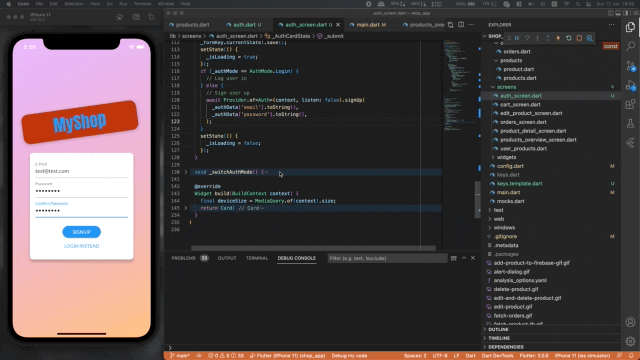
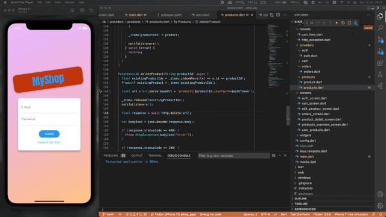

# shop_app

A new Flutter project.

## Getting Started

This project is a starting point for a Flutter application.

A few resources to get you started if this is your first Flutter project:

- [Lab: Write your first Flutter app](https://flutter.dev/docs/get-started/codelab)
- [Cookbook: Useful Flutter samples](https://flutter.dev/docs/cookbook)

For help getting started with Flutter, view our
[online documentation](https://flutter.dev/docs), which offers tutorials,
samples, guidance on mobile development, and a full API reference.

## Demo

| Feature | Demo Gif |
| --- | ----------- |
| Overview |  |
| Edit Product |  |
| Edit and Delete Product |  |
| Alert Dialog |  |
| Snackbar |  |
| Adding product into FB |  |
| Fetch product from FB |  |
| Refresh Indicator |  |
| Patch Product |  |
| Delete Product |  |
| Optimistic Deleting Product |  |
| Optimistic Updating Favorite |  |
| Optimistic Updating Favorite |  |
| Fetch Orders |  |
| Auth Signup |  |
| Handling Errors |  |
| Auth Products |  |
| Logout |  |
| Manual Animation |  |
| Product placeholder |  |
| Adding Hero |  |
| Auto Login |  |
| Animate Orders |  |
